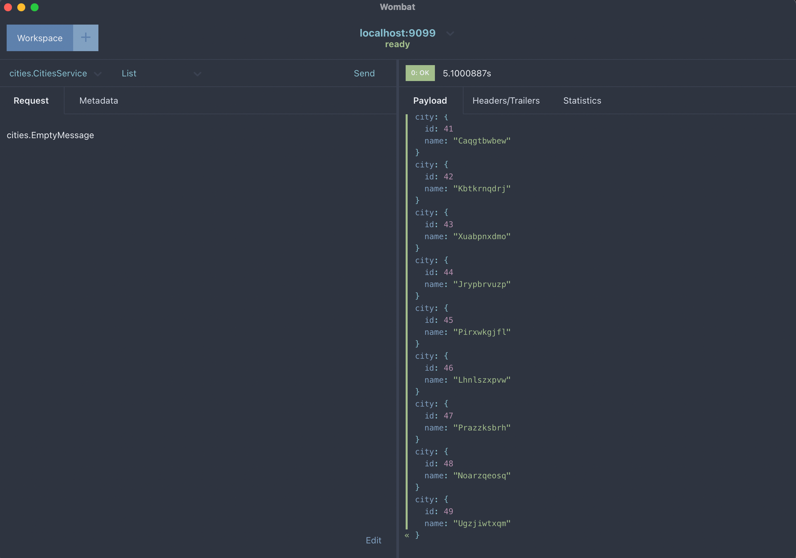
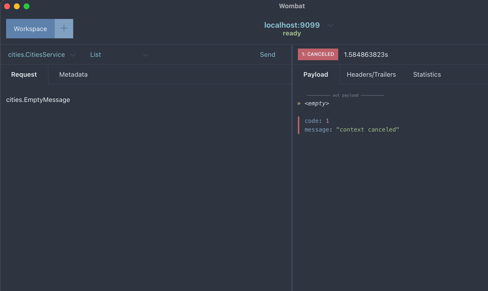
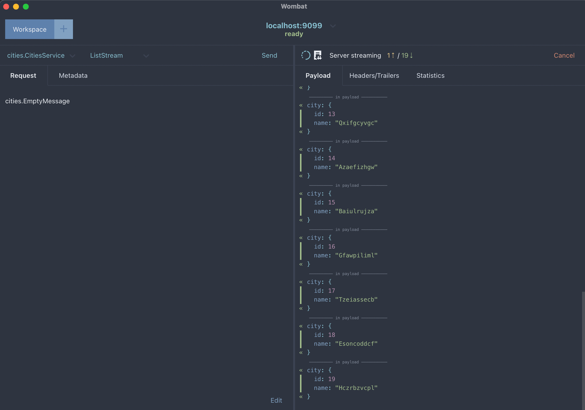
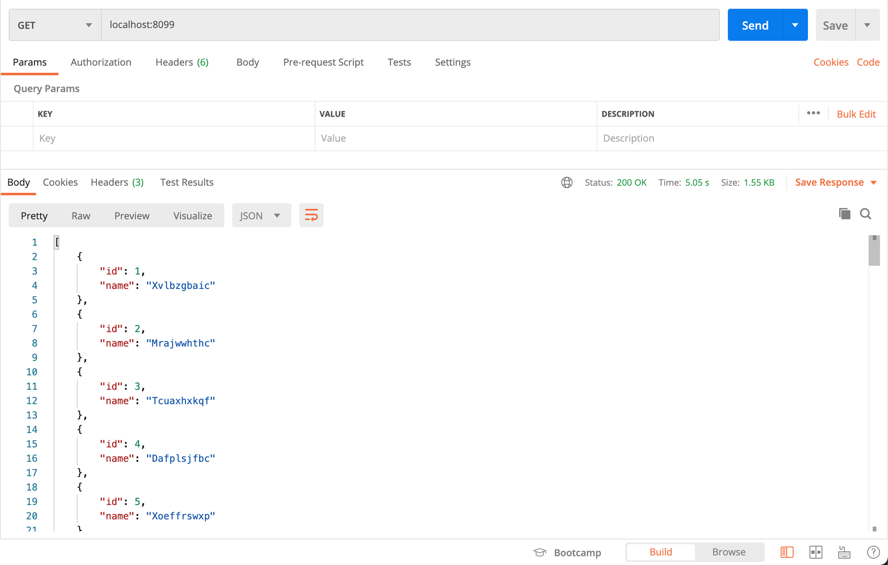

# Penggunaan Context dan Cancel di Golang

Fitur ini penting baik untuk diterapkan dalam 1 service maupun interaksi antara service yang berbeda. Dalam arsitektur microservices, satu service memanggil service lain adalah suatu keniscayaan. Tapi kadang kita abai untuk menghandle pembatalan suatu proses di server jika request telah dibatalkan oleh client. Soal sepele ini, setidaknya berdampak besar pada dua hal : 

1. Menghabiskan resource server untuk hal yang sia-sia karena request sudah tidak valid.
2. Mengurangi integritas data. Data antara client dan server tidak sama sehingga data tidak bisa jadi rujukan valid. 


Dalam tulisan ini, saya akan membahas penggunaan context dan cancel untuk mengatasi persoalan tersebut. Contoh kode akan disampaikan dalam 3 kasus : 

- Unary gRPC API
- Server Streaming gRPC API
- Rest API

Pertama, buatlah project/folder go-cancel dan jalankan perintah go mod init go-cancel

## Unary gRPC API
Buat file proto/cities.proto

```
syntax = "proto3";
package cities;

option go_package = "pb/cities;cities";

message City {
  uint32 id = 1;
  string name = 2;
}

message EmptyMessage {}

message Cities {
  repeated City city = 1; 
}

service CitiesService {
  rpc List(EmptyMessage) returns (Cities) {}
}
```

Jalankan perintah protoc --proto_path=proto proto/*.proto --go_out=plugins=grpc:. untuk menggenerate file proto menjadi kode golang.

Buat file server.go 

```
package main

import (
	"context"
	"log"
	"math/rand"
	"net"
	"os"
	"strings"
	"time"

	"go-cancel/pb/cities"

	"google.golang.org/grpc"
	"google.golang.org/grpc/codes"
	"google.golang.org/grpc/status"
)

type RpcServer struct {
	Grpc *grpc.Server
}

func NewServer() *RpcServer {
	gs := grpc.NewServer()
	return &RpcServer{
		Grpc: gs,
	}
}

func main() {
	if err := run(); err != nil {
		log.Printf("error: shutting down: %s", err)
		os.Exit(1)
	}
}

func run() error {
	port := map[string]string{"grpc": "9099"}
	errorServer := make(chan error)

	rpcServer := NewServer()
	cities.RegisterCitiesServiceServer(rpcServer.Grpc, &citiesServer{})

	go func() {
		errorServer <- runRpcServer(port["grpc"], rpcServer)
	}()

	select {
	case err := <-errorServer:
		if err != nil {
			return err
		}
	}

	return nil
}

func runRpcServer(port string, rpcServer *RpcServer) error {
	listener, err := net.Listen("tcp", ":"+port)
	if err != nil {
		return err
	}

	if err := rpcServer.Grpc.Serve(listener); err != nil {
		return err
	}
	return nil
}

type citiesServer struct{}

func (u *citiesServer) List(ctx context.Context, in *cities.EmptyMessage) (*cities.Cities, error) {
	select {
	case <-ctx.Done():
		return nil, contextError(ctx)
	default:
	}

	var list []*cities.City
	for i := 1; i < 50; i++ {
		time.Sleep(100 * time.Millisecond)
		list = append(list, &cities.City{Id: uint32(i), Name: randSeq(10)})
	}

	return &cities.Cities{City: list}, nil
}

func contextError(ctx context.Context) error {
	switch ctx.Err() {
	case context.Canceled:
		return status.Error(codes.Canceled, "request is canceled")
	case context.DeadlineExceeded:
		return status.Error(codes.DeadlineExceeded, "deadline is exceeded")
	default:
		return nil
	}
}

var letters = []rune("abcdefghijklmnopqrstuvwxyz")

func randSeq(n int) string {
	b := make([]rune, n)
	for i := range b {
		b[i] = letters[rand.Intn(len(letters))]
	}
	return strings.Title(string(b))
}
```

Anda bisa memfokuskan diri untuk membaca kode select case pada baris 73 sampai 77.  Dan func contextError pada baris 88 sampai 97.

```
    select {
	case <-ctx.Done():
		return nil, contextError(ctx)
	default:
	}
```
  
  Kode select case pada baris 73 sampai 77 menggunakan perintah select yang melisten channel ctx.Done(). Artinya jika siklus hidup context sudah berakhir,  akan dilakukan pengecekan apakah ada error di context tersebut. 
 
``` 
  func contextError(ctx context.Context) error {
	switch ctx.Err() {
	case context.Canceled:
		return status.Error(codes.Canceled, "request is canceled")
	case context.DeadlineExceeded:
		return status.Error(codes.DeadlineExceeded, "deadline is exceeded")
	default:
		return nil
	}
}
```
Sementara func contextError pada baris 88 sampai 97 digunakan untuk melakukan pengecekan error di context tersebut. Jika tidak ada error berarti context berakhir dengan happy scenario, namun jika ada error berarti terjadi negative scenario.   

Kita bisa mengetes dengan melakukan pemanggilan grpc API melalui grpc client seperti wombat atau tool grpc client lainnya. Happy scenario akan menghasilkan response 50 data city, dan skenario pembatalan akan menghasilkan error : code: 1, message: "context canceled".



*(Unary gRPC dengan skenario sukses)*



*(Unary gRPC dengan skenario pembatalan)*

## Server Streaming gRPC API
Kita akan membuat suatu service rpc baru yang mencontohkan penggunaan server streaming. Update file proto/cities.proto dengan menambahkan message CityStream dan rpc ListStream.

```
message CityStream {
  City city = 1;
}

service CitiesService {
  rpc ListStream(EmptyMessage) returns (stream CityStream) {}
  rpc List(EmptyMessage) returns (Cities) {}
}
```

Jalankan kembali perintah protoc --proto_path=proto proto/*.proto --go_out=plugins=grpc:. untuk menggenerate file proto menjadi kode golang.

Update file server.go tambahkan func ListStream dengan receiver citiesServer

```
func (u *citiesServer) ListStream(in *cities.EmptyMessage, stream cities.CitiesService_ListStreamServer) error {
	ctx := stream.Context()
	select {
	case <-ctx.Done():
		return contextError(ctx)
	default:
	}

	for i := 1; i < 50; i++ {
		time.Sleep(1 * time.Second)

		res := &cities.CityStream{
			City: &cities.City{Id: uint32(i), Name: randSeq(10)},
		}

		if err := stream.Send(res); err != nil {
			return status.Errorf(codes.Unknown, "cannot send stream response: %v", err)
		}
	}

	return nil
}
```

Sekali lagi, kita bisa mengetes dengan melakukan pemanggilan grpc API melalui grpc client seperti wombat atau tool grpc client lainnya. Happy scenario akan menghasilkan response streaming 50 data city, dan skenario pembatalan akan menghasilkan error : code: 1, message: "context canceled".



*(Server streaming gRPC dengan skenario sukses)*


*(Unary gRPC dengan skenario pembatalan)*

## Rest API
Untuk keperluan rest API kita perlu me-listen port baru dan membuat fungsi rest. Update file server.go dengan menambahkan port rest di func run(), dan memanggil routine runRestserver di func run()

```
    port := map[string]string{"grpc": "9099", "rest": "8099"}
    
        go func() {
		errorServer <- runRestServer(port["rest"], rpcServer)
	}()
```
  
  masih di file server.go, tambahkan fungsi untuk rest
  
```
  func runRestServer(httpPort string, rpcServer *RpcServer) error {
	handler := http.HandlerFunc(rest)

	if err := http.ListenAndServe(":"+httpPort, handler); err != nil {
		return err
	}

	return nil
}

func rest(w http.ResponseWriter, r *http.Request) {
	list, err := new(citiesServer).List(r.Context(), &cities.EmptyMessage{})
	if st, ok := status.FromError(err); err != nil && ok {
		err = fmt.Errorf(st.Message())
	}

	if err != nil {
		log.Println("error get list city", err)
		w.WriteHeader(http.StatusInternalServerError)
		return
	}

	data, err := json.Marshal(list.City)
	if err != nil {
		log.Println("error marshalling result", err)
		w.WriteHeader(http.StatusInternalServerError)
		return
	}

	w.Header().Set("Content-Type", "application/json; charset=utf-8")
	w.WriteHeader(http.StatusOK)
	if _, err := w.Write(data); err != nil {
		log.Println("error writing result", err)
	}
}
```

Kita bisa mengetes dengan melakukan pemanggilan rest API melalui browser maupun postman. Happy scenario akan menghasilkan respon list 50 data city, dan skenario pembatalan akan menghasilkan log error : 2021/06/04 14:01:50 error get list city request is canceled.

Sayangnya ketika dites kode ini tidak berhasil karena kode rest api yang dibuat tidak bisa mendeteksi chanel ctx.Done() saat dicancel. Untuk itu saya modifikasi fungsi List menjadi seperti berikut: 

```
func (u *citiesServer) List(ctx context.Context, in *cities.EmptyMessage) (*cities.Cities, error) {
	/*select {
	case <-ctx.Done():
		return nil, contextError(ctx)
	default:
	} */

	var list []*cities.City
	for i := 1; i < 50; i++ {
		time.Sleep(100 * time.Millisecond)
		list = append(list, &cities.City{Id: uint32(i), Name: randSeq(10)})
	}

	err := contextError(ctx)
	if err != nil {
		return nil, err
	}

	return &cities.Cities{City: list}, nil
}
```

Setelah modifikasi dengan memindahkan pengecekan error tepat sebelum return (atau tepat sebelum commit jika menggunakan transaction, karena jika hasil pengecekan ada error perlu dilakukan rollback), penanganan pembatalan request berhasil dijalankan.



*(Rest API dengan skenario sukses)*

```
make server
go run server.go
2021/06/04 14:00:28 error get list city request is canceled
```

*(Rest API dengan skenario Pembatalan)*

## gRPC Client 
Pada prakteknya, grpc API dipanggil oleh service lain. Berikut saya contohkan bagimana client memanggil service server streaming gRPC API.

```
Buat file client/main.go

package main

import (
	"fmt"
	"go-cancel/pb/cities"
	"io"
	"time"

	"golang.org/x/net/context"
	"google.golang.org/grpc"
	"google.golang.org/grpc/status"
)

func main() {
	ctx := context.Background()
	// ctx, cancel := context.WithDeadline(ctx, time.Now().Add(3*time.Second))
	ctx, cancel := context.WithTimeout(ctx, 3*time.Second)
	defer cancel()

	var conn *grpc.ClientConn
	conn, err := grpc.Dial(":9099", grpc.WithInsecure())
	if err != nil {
		fmt.Printf("did not connect: %s", err)
		return
	}
	defer conn.Close()

	city := cities.NewCitiesServiceClient(conn)

	err = callStream(ctx, city)
	if st, ok := status.FromError(err); err != nil && ok {
		err = fmt.Errorf(st.Message())
	}

	if err != nil {
		fmt.Printf("Error when calling grpc service: %s", err)
		return
	}
}

func callStream(ctx context.Context, city cities.CitiesServiceClient) error {
	stream, err := city.ListStream(ctx, &cities.EmptyMessage{})
	if err != nil {
		return err
	}

	for {
		resp, err := stream.Recv()
		if err == io.EOF {
			fmt.Println("end stream")
			break
		}
		if err != nil {
			return err
		}
		fmt.Printf("Resp : %v", resp.GetCity())
		println()
	}

	return nil
}
```
Ketika dijalankan kode di atas akan menghasilkan error timeout

```
go run client/main.go
Resp : id:1 name:"Tojuzbpsij"
Resp : id:2 name:"Lldeiysdit"
Error when calling grpc service: context deadline exceeded%   
```

Penanganan pembatalan request merupakan hal yang simpel tapi berdampak besar, lagi pula cukup mudah diterapkan.
